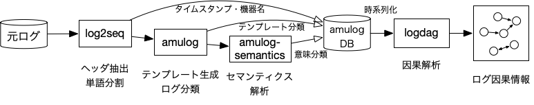

% amulogプロジェクト

[english](./amulog.html) / [japanese](./amulog_ja.html)

[amulogプロジェクト](https://github.com/amulog)はネットワークをはじめとする大規模システムのログデータを統合的に扱うための解析基盤の構築に取り組んでいます。現在以下の様な機能を持つツールをオープンソースで公開しています。

- 多様なログテンプレート生成手法でのログデータ前処理、蓄積と検索、および比較評価 ([amulog](https://github.com/amulog/amulog))
- ログデータのデータ依存部の柔軟な前処理ツール ([log2seq](https://github.com/amulog/log2seq))
- ログデータの意味論解析 ([amulog-semantics](https://github.com/amulog/amulog-semantics))
- ログイベント時系列の因果解析 ([logdag](https://github.com/amulog/logdag))

## これまでの研究テーマ (2022時点)

### 教師あり学習によるログテンプレート生成技術の研究

1. Thieu Nguyen, Satoru Kobayashi, Kensuke Fukuda, "LogDTL: Network Log Template Generation with Deep Transfer Learning", In proceesings of the 6th IEEE/IFIP International Workshop on Analytics for Network and Service Management (AnNet 2021), pp.848-853, Virtual, May, 2021 ([IFIP](http://dl.ifip.org/db/conf/im/im2021-ws1-annet/index.html), [IEEE](https://ieeexplore.ieee.org/document/9464068), [paper](papers/thieu_annet2021.pdf), [slide](papers/annet2021.pdf))

1. Satoru Kobayashi, Kensuke Fukuda, Hiroshi Esaki, "Towards an NLP-based Log Template Generation Algorithm for System Log Analysis", In proceedings of the Ninth International Conference on Future Internet Technologies (CFI'14), p.4, Tokyo, Japan, June, 2014 ([10.1145/2619287.2619290](https://doi.org/10.1145/2619287.2619290), [paper](papers/cfi2014.pdf))

### ログテンプレート生成手法の比較評価基盤の研究

1. Satoru Kobayashi, Yuya Yamashiro, Kazuki Otomo, Kensuke Fukuda, "amulog: A General Log Analysis Framework for Comparison and Combination of Diverse Template Generation Methods", International Journal of Network Management, vol.32, no.4, Wiley, Dec, 2021 ([10.1002/nem.2195](http://doi.org/10.1002/nem.2195), [submit_version](papers/ijnm2021_submit.pdf))

1. Satoru Kobayashi, Yuya Yamashiro, Kazuki Otomo, Kensuke Fukuda, "amulog: A General Log Analysis Framework for Diverse Template Generation Methods", In proceedings of the 16th IFIP/IEEE International Conference on Network and Service Management (CNSM'20), pp.1-5, Virtual, November, 2020 ([10.23919/CNSM50824.2020.9269049](https://doi.org/10.23919/CNSM50824.2020.9269049), [IFIP](http://dl.ifip.org/db/conf/cnsm/cnsm2020/index.html), [paper](papers/cnsm2020.pdf), [poster](papers/cnsm2020_poster.pdf), [slide](papers/cnsm2020_slide.pdf))

### ネットワーク運用データの意味解析に関する研究

1. Kazuki Otomo, Satoru Kobayashi, Kensuke Fukuda, Osamu Akashi, Kimihiro Mizutani, Hiroshi Esaki, "Towards Extracting Semantics of Network Config Blocks", In proceedings of the 9th IEEE International Workshop on Architecture, Design, Deployment & Management of Networks & Applications (ADMNET 2021), pp.1444-1449, Virtual, July, 2021 ([10.1109/COMPSAC51774.2021.00214](https://doi.org/10.1109/COMPSAC51774.2021.00214), [paper](papers/otomo_admnet2021.pdf))

1. Kazuki Otomo, Satoru Kobayashi, Kensuke Fukuda, Hiroshi Esaki, "Latent Semantics Approach for Network Log Analysis: Modeling and its application", In proceedings of the 17th IFIP/IEEE International Symposium on Integrated Network Management (IM'21), pp.215-223, Virtual, May, 2021 ([IFIP](http://dl.ifip.org/db/conf/im/im2021/index.html), [IEEE](https://ieeexplore.ieee.org/document/9464048), [paper](papers/otomo_im2021.pdf))

### ログイベント時系列の異常検知に関する研究

1. Kazuki Otomo, Satoru Kobayashi, Kensuke Fukuda, Hiroshi Esaki, "Latent Variable based Anomaly Detection in Network System Logs", IEICE Transactions on Information and Systems, pp.1644-1652, Vol.E102-D, No.9, September, 2019 ([10.1587/transinf.2018OFP0007](https://doi.org/10.1587/transinf.2018OFP0007), [paper](papers/otomo_ieice2019.pdf))

1. Kazuki Otomo, Satoru Kobayashi, Kensuke Fukuda, Hiroshi Esaki, "Finding Anomalies in Network System Logs with Latent Variables", Workshop on Big Data Analytics and Machine Learning for Data Communication Networks (Big-DAMA), ACM SIGCOMM, pp.8-14, Budapest, Hungary, August, 2018 ([10.1145/3229607.3229608](https://doi.org/10.1145/3229607.3229608), [paper](papers/otomo_bigdama2018.pdf))

1. Kazuki Otomo, Satoru Kobayashi, Kensuke Fukuda, Hiroshi Esaki, "An Analysis of Burstiness and Causality of System Logs", Asian Internet Engineering Conference (AINTEC'17), pp.16-23, Bangkok, Thailand, November, 2017 ([10.1145/3154970.3154973](https://doi.org/10.1145/3154970.3154973), [paper](papers/otomo_aintec2017.pdf))

### ログイベント時系列の因果解析に関する研究

1. Satoru Kobayashi, Keiichi Shima, Kenjiro Cho, Osamu Akashi, Kensuke Fukuda, "Comparative Causal Analysis of Network Log Data in Two Large ISPs", In proceedings of the 7th IEEE/IFIP International Workshop on Analytics for Network and Service Management (AnNet 2022), Budapest, Hungary, April, 2022 ([10.1109/NOMS54207.2022.9789823](https://doi.org/10.1109/NOMS54207.2022.9789823), [paper](papers/annet2022.pdf), [slide](papers/annet2022_slide.pdf))

1. Richard Jarry, Satoru Kobayashi, Kensuke Fukuda, "A Quantitative Causal Analysis for Network Log Data", In proceedings of the 9th IEEE International Workshop on Architecture, Design, Deployment & Management of Networks & Applications (ADMNET 2021), pp.1438-1443, Virtual, July, 2021 ([10.1109/COMPSAC51774.2021.00213](https://doi.org/10.1109/COMPSAC51774.2021.00213), [paper](papers/richard_admnet2021.pdf), [slide](papers/admnet2021.pdf))

1. Satoru Kobayashi, Kazuki Otomo, Kensuke Fukuda, "Causal analysis of network logs with layered protocols and topology knowledge", In proceedings of the 15th IFIP/IEEE International Conference on Network and Service Management (CNSM'19), pp.1-9, Halifax, Canada, October, 2019 ([10.23919/CNSM46954.2019.9012718](https://doi.org/10.23919/CNSM46954.2019.9012718), [IFIP](http://dl.ifip.org/db/conf/cnsm/cnsm2019/index.html), [paper](papers/cnsm2019.pdf), [slide](papers/cnsm2019_slide.pdf))

1. Satoru Kobayashi, Kazuki Otomo, Kensuke Fukuda, Hiroshi Esaki, "Mining Causality of Network Events in Log Data", IEEE Transactions on Network and Service Management, pp.53-67, vol.15, no.1, March, 2018 ([10.1109/TNSM.2017.2778096](https://doi.org/10.1109/TNSM.2017.2778096), [paper](papers/tnsm2018.pdf))

1. Satoru Kobayashi, Kensuke Fukuda and Hiroshi Esaki, "Mining causes of network events in log data with causal inference", In proceedings of the 13th IFIP/IEEE International Symposium on Integrated Network Management (IM'17), pp.45-53, Lisbon, Portugal, May, 2017 ([10.23919/INM.2017.7987263](https://doi.org/10.23919/INM.2017.7987263), [IFIP](http://dl.ifip.org/db/conf/im/im2017/index.html) [paper](papers/im2017.pdf), [slide](papers/im2017_slide.pdf))

