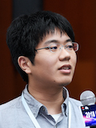

% Satoru Kobayashi



english / [japanese](index_ja.html)

## Profile

### Affiliation  
Assistant Professor,
Graduate School of Natural Science and Technology,
Okayama University

### Experience  
- Oct 2022 - Current: Okayama University, Assistant Professor
- April 2018 - Sep 2022: National Institute of Informatics, Project Researcher
- September 2019 - March 2022: Shibaura Institute of Technology, Part-time Lecturer  

### Degree  
- March 2018: Ph.D. degree in Information Science and Technology (The University of Tokyo)  
- March 2015: Master of Information Science and Technology (The University of Tokyo)  
- March 2013: Bachelor of Engineering (The University of Tokyo)  

### Related organization
- [WIDE Project](http://www.wide.ad.jp/index.html)  
- National Institute of Informatics, [Fukuda Lab.](http://www.fukuda-lab.org/)
- The University of Tokyo, [Esaki Lab.](https://www.hongo.wide.ad.jp/en/)

### Mail  
- sat [at] okayama-u [dt] ac [dt] jp
- sat [at] 3at [dt] work  

## Publications

### Journal

<<< ./list_journal.md


### International Conference (w/ review)

<<< ./list_conference.md


### Technical Report

<<< ./list_tecrep_en.md

### Oral Presentation

1. Satoru Kobayashi, "Causal Analysis of Network Log Events", JFLI Workshop 2020 on Next Generation Networking, Tokyo, Japan, Feb, 2020 (Invited, [link](https://tlab.hongo.wide.ad.jp/jfli-workshop-2020/), [slide](papers/jfli2020.pdf))

1. Satoru Kobayashi, "Mining causality of network events in log data", International Cloud Resiliency Workshop 2018, Xi'an, China, Oct, 2018 (Invited, [link](http://www.i2crw.org/), [slide](papers/crw2018.pdf))

### Poster Presentation

1. Yuya Yamashiro, __Satoru Kobayashi__, Kensuke Fukuda, Hiroshi Esaki, "Approach to Better Log Template Generation", Internet Conference 2018, Tokyo, Japan, Nov, 2018 ([Poster Award](https://www.internetconference.org/ic2018/program.html#award))

1. Yudai Aratsu, __Satoru Kobayashi__, Kensuke Fukuda, Hiroshi Esaki, "Collecting a large number of active IPv6 addresses", Internet Conference 2018, Tokyo, Japan, Nov, 2018 ([Poster Award](https://www.internetconference.org/ic2018/program.html#award))


## Activities

### Awards

1. IEEE/IFIP IM 2017 Student Travel Grants, May, 2017

1. ACM SIGCOMM Grants/CoNext 2016, Dec, 2016

1. Dean's award for outstanding thesis (master's thesis), March, 2015
<!-- 東京大学大学院情報理工学系研究科 研究科長賞, 2015年3月 -->

### Research Funds

1. JSPS Grant-in-Aid for Early-Career Scientists, "Collaborative operational data analysis for network automation", Apr 2022 - Mar 2025 (As principal researcher, [22K17886](https://kaken.nii.ac.jp/en/grant/KAKENHI-PROJECT-22K17886/))

1. MIC Strategic Information and Communications R&D Promotion Programme (SCOPE), "セマンティクス抽出と因果解析によるネットワーク障害対応支援に関する研究", Apr 2019 - Mar 2022 (#191603009)

1. JSPS Grant-in-Aid for Early-Career Scientists, "Knowledge mining of large-scale network operational data for troubleshooting and predictive analysis", Apr 2019 - Mar 2021 (As principal researcher, [19K20262](https://kaken.nii.ac.jp/en/grant/KAKENHI-PROJECT-19K20262/))


### Committee

1. IPSJ Journal Reviewer, 2021-Current

### External Peer Review

1. IEEE Transactions on Network and Service Management, 2019-2022

1. IEICE Transactions on Communications, 2018

1. IEEE International Workshop on Big Data Management and Infrastructure for the Internet of Things, 2018

### Lecture

- College of Engineering and Design Department of Engineering and Design, Shibaura Institute of Technology, "Information Network" (Winter term, [2019](http://syllabus.sic.shibaura-it.ac.jp/syllabus/2019/dsn/115765.html.en), [2020](http://syllabus.sic.shibaura-it.ac.jp/syllabus/2020/dsn/120860.html.en), [2021](http://syllabus.sic.shibaura-it.ac.jp/syllabus/2021/dsn/126034.html.en))

### Others

- [GitHub](https://github.com/cpflat)
- [Google scholar](https://scholar.google.co.jp/citations?user=9G_WRYEAAAAJ)
- [Linkedin](https://www.linkedin.com/in/sat-pub/)
- [researchmap](https://researchmap.jp/sat-pub/)

- Bio 
```
Satoru Kobayashi received the Ph.D. degree in information science and technology from the University of Tokyo, Tokyo Japan, in 2018.
He is a Project Researcher at the National Institute of Informatics (NII).
His research interests are network management and data mining.
```

## About this page

<!--
- [www.3at.work](http://www.3at.work) is a personal home server
- [sat.hongo.wide.ad.jp](http://sat.hongo.wide.ad.jp) is a mirror server hosted in [Esaki Lab](http://www.hongo.wide.ad.jp/index.html).
-->
- This page is hosted on Github Pages. [cpflat.github.io](https://cpflat.github.io)


